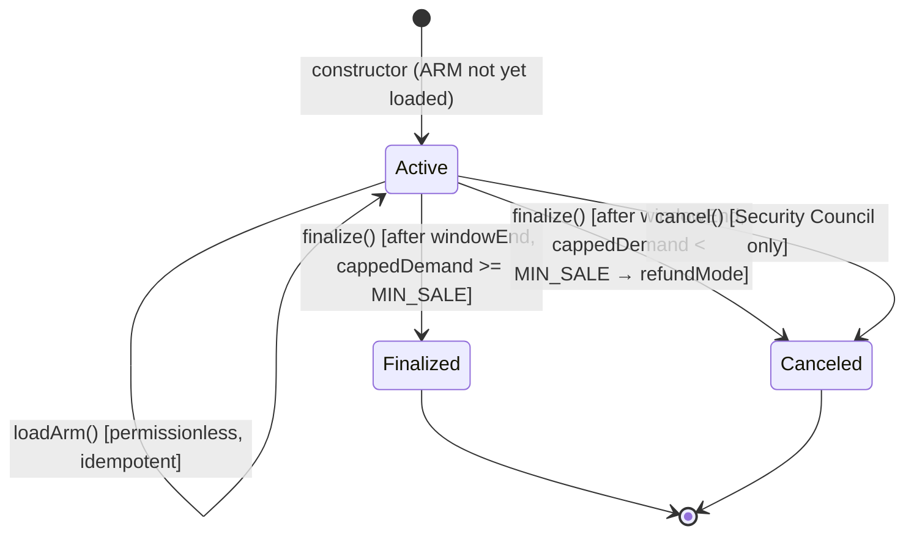

# Crowdfund Phase Transitions

State machine for ArmadaCrowdfund, derived from the Phase enum and phase transition logic.

## Phase Diagram



## Time Windows

```
                     launchTeamInviteEnd
                           │
  ◄── Setup ──►◄───── Active Window (3 weeks) ─────►◄── Post-Window ──►
  │            │           │                         │                  │
  deploy   windowStart     │                    windowEnd          claimDeadline
                           │                         │            (3 years)
                     Seeds-only invite               │
                     period ends here           finalize() allowed
```

| Timestamp | Source | Purpose |
|-----------|--------|---------|
| `windowStart` | Constructor param | Invites and commits begin |
| `launchTeamInviteEnd` | `windowStart + 7 days` | Launch team invite budget expires |
| `windowEnd` | `windowStart + 21 days` | Commits close, finalize() enabled |
| `claimDeadline` | `windowEnd + 3 years` | Unclaimed ARM returned to treasury |

## Actions by Phase

### Active Phase

| Action | Who | Constraints |
|--------|-----|-------------|
| `addSeeds()` / `addSeed()` | Launch team | Before windowStart (week 0 only), requires ARM loaded |
| `launchTeamInvite()` | Launch team | Before launchTeamInviteEnd, within hop-1/hop-2 budgets |
| `invite()` | Whitelisted participants | After windowStart, within invite limits per hop |
| `commit()` | Whitelisted participants | After windowStart, before windowEnd |
| `loadArm()` | Anyone | Idempotent, verifies ARM balance >= MAX_SALE |
| `cancel()` | Security Council | Any time during Active |
| `finalize()` | Anyone | After windowEnd |

### Finalized Phase

| Action | Who | Constraints |
|--------|-----|-------------|
| `claim()` | Committed participants | Before claimDeadline, not already claimed |
| `claimRefund()` | Committed participants (refundMode) | Before claimDeadline |
| `withdrawProceeds()` | Admin | Once, sends net proceeds to treasury |
| `withdrawUnallocatedArm()` | Admin | Once, sends unallocated ARM to treasury |
| `withdrawExpiredArm()` | Anyone | After claimDeadline, sends unclaimed ARM to treasury |

### Canceled Phase

| Action | Who | Constraints |
|--------|-----|-------------|
| `claimRefund()` | Committed participants | Full USDC refund |
| `withdrawUnallocatedArm()` | Admin | Returns all ARM to treasury |

## Finalization Decision Tree

```mermaid
flowchart TD
    A[finalize() called] --> B{block.timestamp > windowEnd?}
    B -->|no| X1[REVERT: window not ended]
    B -->|yes| C[Compute cappedDemand via _iterateCappedDemand]

    C --> D{cappedDemand < MIN_SALE?}
    D -->|yes| E[refundMode = true, phase = Finalized]
    E --> F[All participants get full USDC refunds]

    D -->|no| G{cappedDemand >= ELASTIC_TRIGGER?}
    G -->|yes| H[Expand MAX_SALE to ELASTIC_MAX]
    G -->|no| I[Keep MAX_SALE as BASE_SALE]

    H --> J[Compute per-hop allocations via _allocate]
    I --> J
    J --> K[phase = Finalized, push proceeds to treasury]
```

### Sale Parameters

| Parameter | Value | Description |
|-----------|-------|-------------|
| `BASE_SALE` | $1,200,000 | Base maximum sale |
| `ELASTIC_MAX` | $1,800,000 | Expanded maximum if elastic trigger met |
| `MIN_SALE` | $1,000,000 | Minimum raise — below this, full refund |
| `ELASTIC_TRIGGER` | $1,500,000 | Capped demand threshold to trigger expansion |
| `ARM_PRICE` | $1.00 | Fixed price per ARM token |
| `MAX_SEEDS` | 160 | Maximum hop-0 participants |
| `NUM_HOPS` | 3 | Hop-0 (seeds), hop-1 (invitees), hop-2 (sub-invitees) |

### Allocation Priority

```
Available pool = final MAX_SALE (base or elastic)

1. Hop-0 gets up to hop0CeilingBps% of pool
   └─ Leftover cascades to hop-1

2. Hop-1 gets up to hop1CeilingBps% of pool + hop-0 leftover
   └─ Leftover cascades to hop-2

3. Hop-2 gets remainder, with a guaranteed floor of HOP2_FLOOR_BPS (5%)

Within each hop: if demand > ceiling, pro-rata allocation proportional to capped commits.
```
