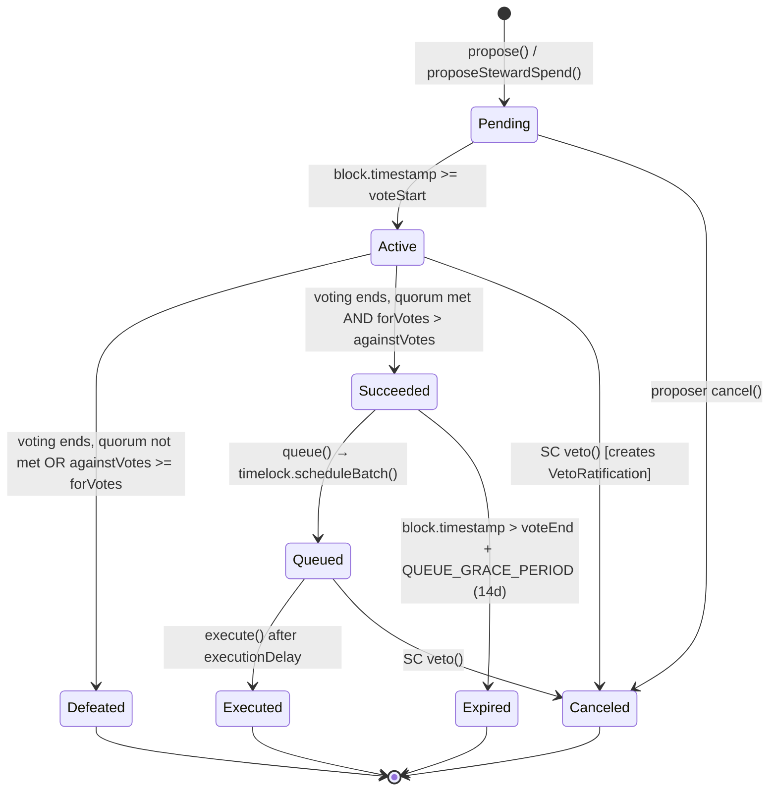

# Governance Proposal Lifecycle

State machine for ArmadaGovernor proposals, derived from `state()` at line 827.

## Proposal States



**Note:** Steward proposals skip Pending (votingDelay = 0), transitioning directly to Active.

## Proposal Type Timing

| Type | Voting Delay | Voting Period | Execution Delay | Total Lifecycle | Quorum |
|------|-------------|---------------|-----------------|-----------------|--------|
| Standard | 2d | 7d | 2d | 11d | 20% |
| Extended | 2d | 14d | 7d | 23d | 30% |
| VetoRatification | 0 | 7d | 0 | 7d | 20% |
| Steward | 0 | 7d | 2d | 9d | 20% |

- Standard/Extended timing is adjustable via governance (within bounds)
- VetoRatification/Steward timing is immutable (bypasses `setProposalTypeParams()` bounds)

## Veto / Ratification Flow

```mermaid
flowchart TD
    A[Active or Queued proposal] -->|SC calls veto()| B[Original proposal → Canceled]
    B --> C[VetoRatification proposal auto-created]
    C --> D{Community votes}
    D -->|forVotes > againstVotes + quorum met| E[Veto DENIED → calldataHash added to vetoDeniedHashes]
    D -->|otherwise| F[Veto UPHELD → no further action]
    E -->|proposer re-submits identical proposal| G[New proposal — cannot be vetoed again for same calldata]
```

- Veto ratification has 0 voting delay and 0 execution delay — resolution is immediate
- `vetoDeniedHashes` prevents double-veto on the same proposal content
- Community can override SC veto with sufficient voting participation

## Pre-Proposal Guards

```mermaid
flowchart TD
    A[propose() called] --> B{windDownActive?}
    B -->|yes| X1[REVERT: Gov_GovernanceEnded]
    B -->|no| C{quietPeriodActive?}
    C -->|yes| X2[REVERT: Gov_QuietPeriodActive]
    C -->|no| D{caller has >= proposalThreshold?}
    D -->|no| X3[REVERT: Gov_BelowThreshold]
    D -->|yes| E{auto-classify calldata}
    E -->|extended selector found| F[Force ProposalType.Extended]
    E -->|distribute > 5% treasury| F
    E -->|no triggers| G[Use declared type]
    F --> H[Create proposal]
    G --> H
```

- **Proposal threshold**: 5,000 ARM (absolute constant, not a fraction of supply — see GOVERNANCE.md §Proposal threshold)
- **Auto-classification**: Function selectors in `extendedSelectors` mapping force Extended type. `distribute()` calls exceeding 5% of treasury balance also force Extended.
- **Quiet period**: Configurable cooldown after a failed proposal to prevent spam

## Quorum Calculation

```
eligibleSupply = getPastTotalSupply(snapshotBlock)
                 - balanceOf(treasuryAddress)           // at proposal creation
                 - sum(balanceOf(excludedAddresses))     // at proposal creation

quorum = (eligibleSupply * snapshotQuorumBps) / 10000

quorumReached = (forVotes + againstVotes + abstainVotes) >= quorum
```

- Treasury balance and excluded balances are snapshotted at proposal creation (`p.snapshotEligibleSupply`)
- All vote types (for, against, abstain) count toward quorum
- `getPastTotalSupply` uses the historical checkpoint at `snapshotBlock = block.number - 1`
