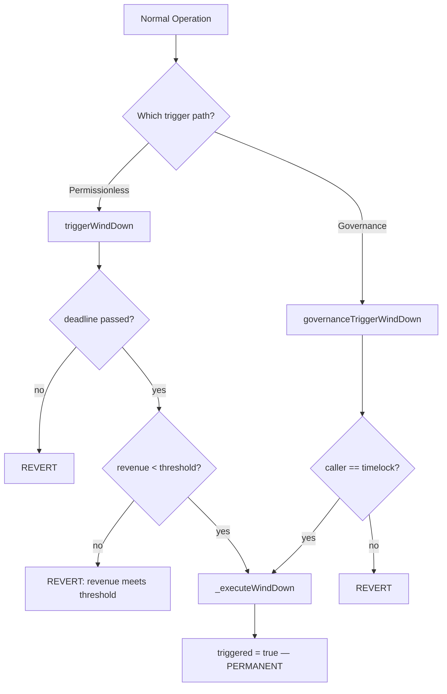
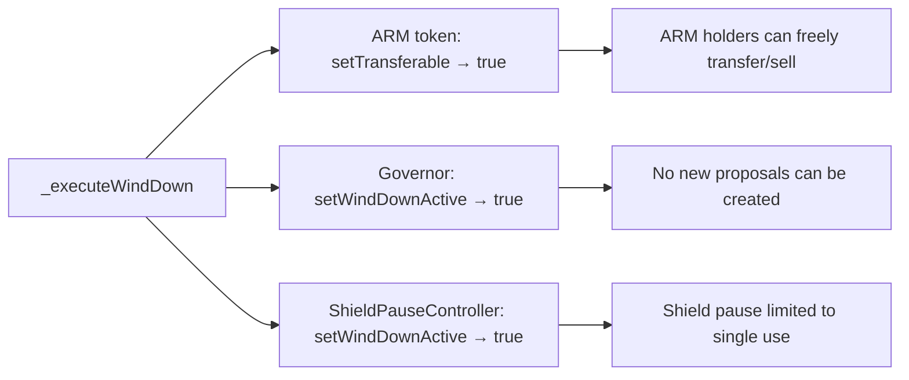
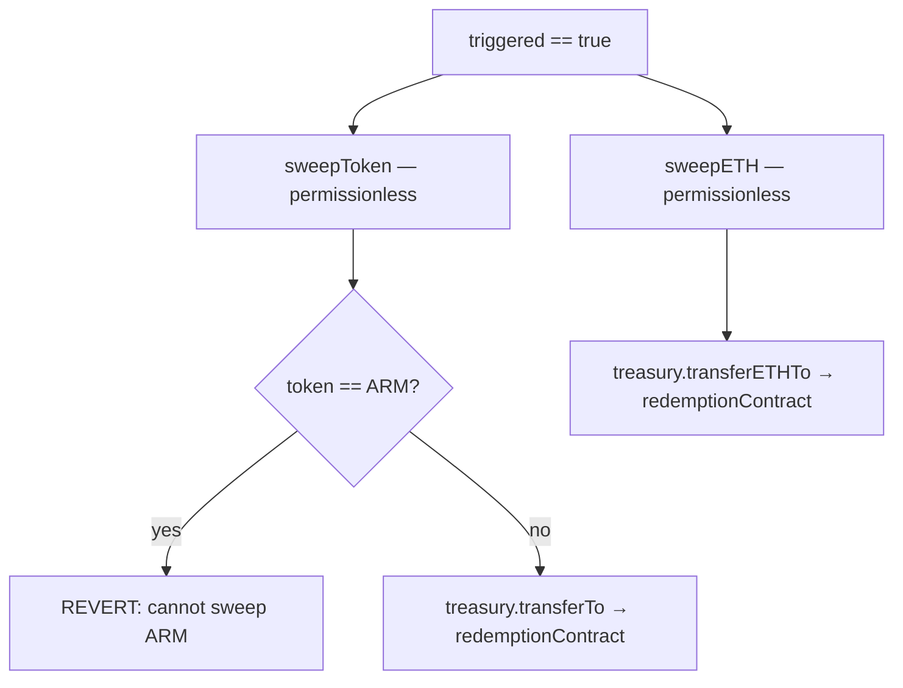
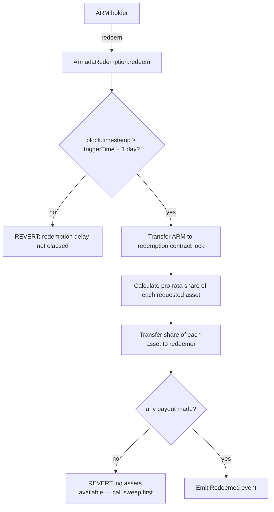

# Wind-Down Sequence

State machine for ArmadaWindDown and the post-trigger redemption flow.

## Trigger Paths

- **Permissionless path**: Anyone can trigger if `block.timestamp > windDownDeadline` AND `recognizedRevenueUsd < revenueThreshold`. Designed as a safety valve if the protocol fails to generate sufficient revenue.
- **Governance path**: Timelock can trigger at any time, no conditions. Requires a governance proposal (Extended type).
- Both paths converge on `_executeWindDown()`. Once `triggered = true`, it cannot be reversed.

## On-Trigger Effects

| Effect | Contract | Method | Impact |
|--------|----------|--------|--------|
| Enable ARM transfers | ArmadaToken | `setTransferable(true)` | Holders can move ARM to redeem |
| Disable governance | ArmadaGovernor | `setWindDownActive()` | All propose/vote/execute reverts |
| Post-wind-down pause mode | ShieldPauseController | `setWindDownActive()` | SC gets one final pause only |

## Treasury Sweep

After trigger, anyone can sweep non-ARM assets from treasury to the redemption contract:

- **ARM is never swept** — treasury ARM stays locked permanently
- Sweep bypasses outflow rate limits (wind-down authority)
- Anyone can call sweep — no access control after trigger

## Redemption Flow

- Pro-rata: `payout = (armAmount / circulatingSupply) * assetBalance`
- Permissionless, no admin, no deadline, no upgradeability
- Multiple redemption tokens supported (USDC, ETH, etc.)
- ARM transferred to redemption contract is locked permanently (denominator shrinks)

### Redemption Delay (issue #254 mitigation)

A 1-day delay (`REDEMPTION_DELAY = 1 days`) enforced from `ArmadaWindDown.triggerTime`
gates all redemptions. This is a **social-coordination window**, not a correctness
guarantee: anyone can run `sweepToken`/`sweepETH` during the delay, and the delay
gives humans, relayers, and multisigs time to coordinate.

- Start clock: `triggerTime` is written in `_executeWindDown()` on both trigger paths.
- End clock: redemption is allowed when `block.timestamp >= triggerTime + 1 day`.
- Wiring: `ArmadaRedemption.setWindDown()` is a one-time deployer-gated setter that
  wires the wind-down reference post-deploy (breaks the constructor-circularity that
  would otherwise force a redeploy).

### `anyPayout` Guard (issue #254 mitigation)

`redeem()` tracks whether any non-zero transfer was made to the caller. If the loop
completes and ETH block runs without producing any payout, the transaction reverts
and ARM is not locked. This closes the catastrophic case where a caller redeems
before any sweep has landed: without the guard, ARM would have been locked for zero
return, and the redistributed circulating-supply math would flow the unpaid share
pro-rata to other holders (actual fund loss, not just a stuck claim).

Note: the guard prevents the all-zero case but not the **partial-sweep forfeiture**
case (some assets swept, others not — the caller forfeits their share of the
unswept ones). The 1-day delay is the primary mitigation for that scenario by
giving coordinators time to complete all sweeps before redemption opens.

## Governable Parameters (Pre-Trigger Only)

| Parameter | Setter | Constraint |
|-----------|--------|------------|
| `revenueThreshold` | `setRevenueThreshold()` — timelock only | Must be > 0 (prevents disabling trigger) |
| `windDownDeadline` | `setWindDownDeadline()` — timelock only | Must be in the future |

Both setters revert after trigger (`require(!triggered)`). Both are Extended selectors requiring 30% quorum and 14-day voting.
