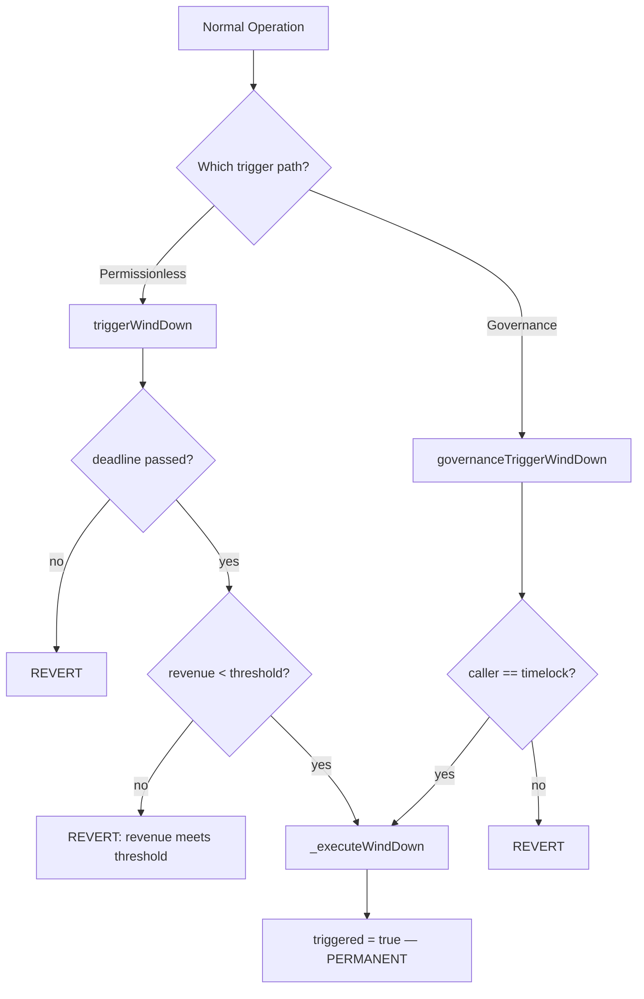
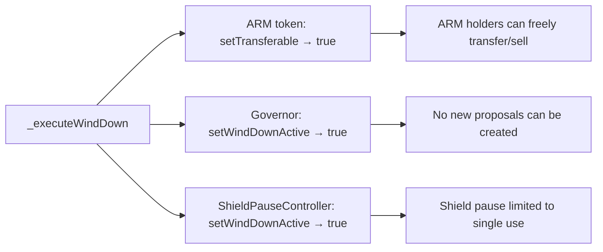
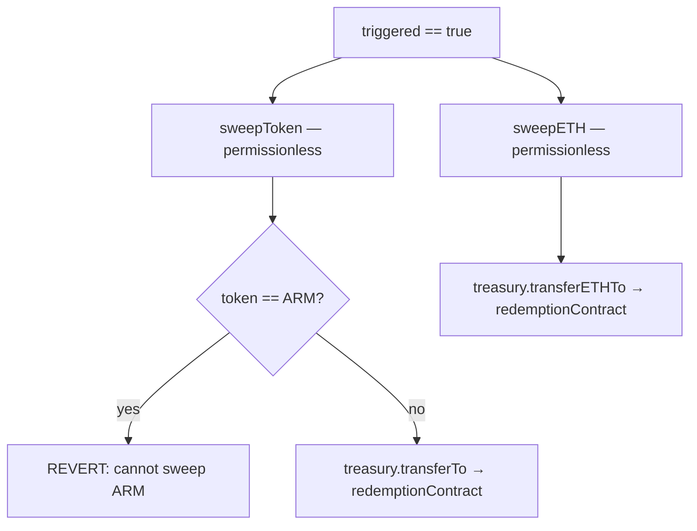
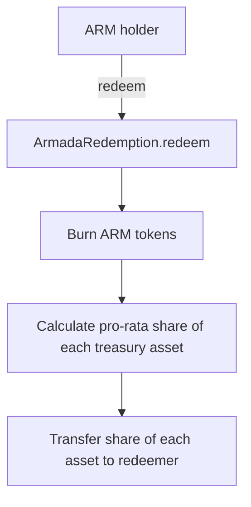

# Wind-Down Sequence

State machine for ArmadaWindDown and the post-trigger redemption flow.

## Trigger Paths

- **Permissionless path**: Anyone can trigger if `block.timestamp > windDownDeadline` AND `recognizedRevenueUsd < revenueThreshold`. Designed as a safety valve if the protocol fails to generate sufficient revenue.
- **Governance path**: Timelock can trigger at any time, no conditions. Requires a governance proposal (Extended type).
- Both paths converge on `_executeWindDown()`. Once `triggered = true`, it cannot be reversed.

## On-Trigger Effects

| Effect | Contract | Method | Impact |
|--------|----------|--------|--------|
| Enable ARM transfers | ArmadaToken | `setTransferable(true)` | Holders can move ARM to redeem |
| Disable governance | ArmadaGovernor | `setWindDownActive()` | All propose/vote/execute reverts |
| Post-wind-down pause mode | ShieldPauseController | `setWindDownActive()` | SC gets one final pause only |

## Treasury Sweep

After trigger, anyone can sweep non-ARM assets from treasury to the redemption contract:

- **ARM is never swept** — treasury ARM stays locked permanently
- Sweep bypasses outflow rate limits (wind-down authority)
- Anyone can call sweep — no access control after trigger

## Redemption Flow

- Pro-rata: `payout = (armAmount / armTotalSupply) * assetBalance`
- Permissionless, no admin, no deadline, no upgradeability
- Multiple redemption tokens supported (USDC, ETH, etc.)
- ARM total supply decreases with each redemption (burn)

## Governable Parameters (Pre-Trigger Only)

| Parameter | Setter | Constraint |
|-----------|--------|------------|
| `revenueThreshold` | `setRevenueThreshold()` — timelock only | Must be > 0 (prevents disabling trigger) |
| `windDownDeadline` | `setWindDownDeadline()` — timelock only | Must be in the future |

Both setters revert after trigger (`require(!triggered)`). Both are Extended selectors requiring 30% quorum and 14-day voting.
